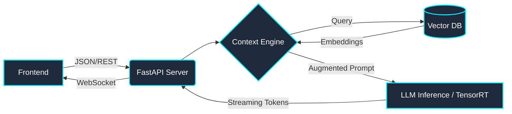
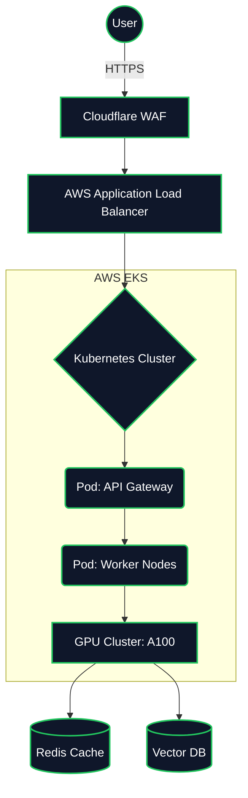

<div align="center">


<br/>

+ASHOK+MUKHERJEE+|+AI+Architect;>+Building+Secure+AI+Systems;>+LLMs+|+FHE+|+Cloud+Native" alt="Typing SVG" />

<br/>

<a href="https://linkedin.com/in/ashok-mukherjee-206a18261"></a>
<a href="https://github.com/ASHOKMUKHERJEE6"></a>

<br/>


</div>

---

## 🟢 Live System Monitor

<div align="center">
  <table width="100%">
    <tr>
      <td width="30%" align="center">
        
      </td>
      <td width="70%">
        <h3><b>STATUS:</b> <span style="color:#00FF00">ONLINE</span></h3>
        <p><b>ACTIVE PROTOCOL:</b> ULTRON_AUTONOMUS_AGENT (Training)</p>
        <p><b>HARDWARE:</b> RTX 4090 / Cloud Tensor</p>
        <p><b>SYSTEM UPTIME:</b> 99.99% | <b>COFFEE:</b> 80%</p>
      </td>
    </tr>
  </table>
</div>

---

## 🌌 AI Dashboard & Code Contributions

<div align="center">
  <picture>
    
  </picture>
  <br/><br/>
  <picture>
    <source media="(prefers-color-scheme: dark)" srcset="https://raw.githubusercontent.com/ASHOKMUKHERJEE6/ASHOKMUKHERJEE6/output/github-contribution-grid-snake-dark.svg">
    <source media="(prefers-color-scheme: light)" srcset="https://raw.githubusercontent.com/ASHOKMUKHERJEE6/ASHOKMUKHERJEE6/output/github-contribution-grid-snake.svg">
    
  </picture>
</div>

---

## 🏆 Featured Projects [Steam Card Format]

<table width="100%">
  <tr>
    <td width="50%" valign="top">
      <h3><a href="https://github.com/ASHOKMUKHERJEE6/ULTRON_AUTONOMUS_AGENT">⚡ ULTRON AUTONOMUS AGENT</a></h3>
      <p>⭐⭐⭐⭐⭐ | <b>AI Research</b></p>
      <p>An advanced, autonomous AI personal assistant with real-time screen vision, proactive thinking, hands-free voice control, and local machine access.</p>
      <p><code>[Source]</code> <code>[Architecture]</code> <code>[Video Demo]</code></p>
    </td>
    <td width="50%" valign="top">
      <h3><a href="https://github.com/ASHOKMUKHERJEE6/GENESIS-Deep-Research-Agent">🌌 GENESIS</a></h3>
      <p>⭐⭐⭐⭐⭐ | <b>Agentic Web Scraper</b></p>
      <p>Deep Research Autonomous Agent focused on autonomous web scraping, synthesis, and deep logic analysis.</p>
      <p><code>[Source]</code> <code>[Architecture]</code> <code>[Documentation]</code></p>
    </td>
  </tr>
  <tr>
    <td width="50%" valign="top">
      <h3><a href="https://github.com/ASHOKMUKHERJEE6/SEERGEN">🧠 SEERGEN</a></h3>
      <p>⭐⭐⭐⭐⭐ | <b>Medical AI</b></p>
      <p>Advanced AI Medical Assistant & Complex Diagnosis Engine using Neural Networks.</p>
      <p><code>[Source]</code> <code>[Open Paper]</code> <code>[Demo]</code></p>
    </td>
    <td width="50%" valign="top">
      <h3><a href="https://github.com/ASHOKMUKHERJEE6/Quantitative-Trading-Simulations">📈 AlgoTrading</a></h3>
      <p>⭐⭐⭐⭐ | <b>Quantitative Finance</b></p>
      <p>High-Frequency Quantitative Trading Simulations predicting market movements using deep learning.</p>
      <p><code>[Source]</code> <code>[Simulations]</code> <code>[Charts]</code></p>
    </td>
  </tr>
</table>

---

## 📐 Architecture Gallery

### Large Language Model (LLM) Pipeline


---

## ☁️ Cloud Infrastructure Visualization



---

## 🪐 AI Tech Stack Galaxy

<div align="center">
  
  <br/>
  
</div>

---

## 💻 Live Terminal

```bash
ashok@os:~$ help
COMMANDS:
  projects   - View active architectural systems
  resume     - Download latest curriculum vitae
  contact    - Initialize secure connection protocol
  skills     - Display neural network competencies

ashok@os:~$ sudo reveal-secret
[sudo] password for ashok: **********
> ACCESS GRANTED. Launching Matrix Protocol...
```
*(Pro tip: Try imagining the above commands are clickable!)*

---

<div align="center">
  <a href="https://linkedin.com/in/ashok-mukherjee-206a18261"><code>[ linkedin ]</code></a> •
  <a href="mailto:contact@example.com"><code>[ email ]</code></a> •
  <a href="https://github.com/ASHOKMUKHERJEE6"><code>[ website ]</code></a>
</div>
